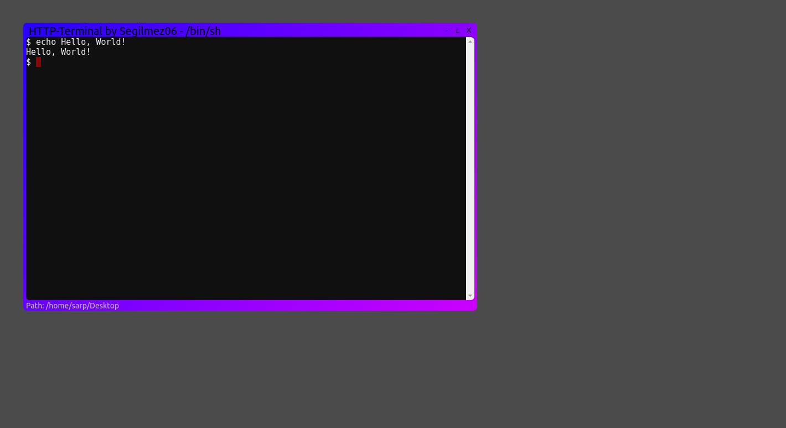

# HTTP-Terminal
A graphical Linux terminal that runs on web browser.



### Usage
This project is really easy to use. Just run this commands:
```shell
git clone https://github.com/Segilmez06/HTTP-Terminal
cd HTTP-Terminal
chmod +x ./start-server
./start-server
```
After this command, open your browser and go to [localhost:2348](http://localhost:2348) and have fun!
